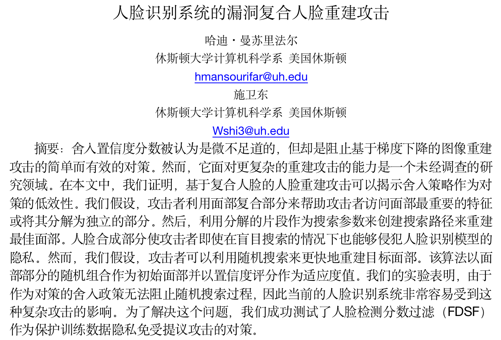

# 毕设 第一周汇报

## 一、论文研读

## 1. 机器学习/深度学习/强化学习的基本概念及关系：

#### (1) 机器学习：通过机器学习过程的具有无确定规则的定义功能的程序

#### (2) 神经网络：在机器学习的算法基础上添加模拟人类神经网络的结构

#### (3) 强化学习：通过程序与外部环境的反馈做到基于反馈优化计算的功能

## 2. 监督学习与无监督学习的基本概念：

#### (1) 监督学习：数据集有标签，多用于分类、回归问题，如图像识别、垃圾邮件分类等

#### (2) 无监督学习：数据集不带标签，多用于聚类、数据降维等，如预训练、入侵检测等

## 3. 敌手模型：

**攻击者称为敌手，敌手模型可以从敌手目标、敌手知识、敌手能力、敌手策略 4 个维度刻画**

#### (1) 敌手目标：分为破坏机器学习的机密性、完整性、可用性

- 机密性：包含用户隐私的敏感信息不被泄露

- 完整性：敌手诱导模型行为或者使模型在预测中输出指定分类标签

- 可用性：阻止用户获得模型正确的输出或者阻止获取模型本身的一些特性，使其在目标环境下不可信赖

#### (2) 敌手知识：包括模型的训练数据及特征、模型结构及参数、决策函数、访问目标模型得到反馈信息等

#### (3) 敌手能力：指敌手在具有一定知识背景下，对模型或者训练数据、测试数据的控制能力

#### (4) 敌手策略：指敌手为达到攻击目标，根据自身的知识和能力，采取的具体攻击方式，如修改数据集标签信息、注入恶意数据、逆向攻击提取敏感数据等

## 4、机器学习的安全威胁以及安全性防御技术

### 训练阶段

- 投毒攻击：敌手对训练数据进行修改、删除或注入精心制作的恶意数据，改变训练数据原有的分布，使学习算法在逻辑上发生改变进而威胁目标模型。当模型预测误差小于$\epsilon$时，其最大容忍修改训练数据集的概率是 b，b 应满足$b\leq\frac{\epsilon}{\epsilon+1}$

### 预测阶段

- 对抗攻击：敌手精心制造使模型错分类的样本称为对抗样本，此阶段的攻击分为黑盒攻击和白盒攻击
- 询问攻击：通过观察特定的输入对应的输出信息，建立与目标模型相似的模型进行攻击

### 机器学习的安全性防御技术

- 正则化：通过为代价函数添加正则项（也叫惩罚项）提高目标模型的泛化能力，在预测中遇见未知数据集具有良好的适应性抵抗攻击

- 对抗训练：在训练数据集中引入对抗样本，通过合法化的对抗样本对目标模型的训练提供模型的顽健性 (由于在对抗训练中引入所有未知攻击的对抗样本是不现实的，对抗样本的非适应性导致对抗训练的局限性)

- 防御精馏：防御者与敌手之间的博弈可表示为：敌手最小化制造样本的成本，防御者最小化存在对抗样本的代价函数。防御者与敌手不断交互博弈的过程增加目标模型的顽健性

## 5、机器学习的隐私威胁及隐私保护技术

### 训练阶段

- 窃取训练数据：机器学习训练方式分为集中式和联合分布式

### 预测阶段

- 逆向攻击：可以提取训练数据(部分或全部)或训练数据的统计特征

- 成员推理攻击：给定一条记录可以判定是否在训练数据集中

### 机器学习隐私保护技术

- 同态加密技术：允许用户直接在密文上做运算，得到的结果解密后与在明文下运算结果一致，是最直接有效保护用户隐私的一项技术

- 差分隐私技术：通过引入噪声使至多相差 1 个数据的 2 个数据集查询结果概率不可分

- 安全多方计算(MPC)

## 二、代码部分
下载了CIFAR-10 数据集，并对数据集进行预处理，进行模型训练，成功跑通，并生成了训练和数据时每个图像类型的准确度和损失函数，用plot绘制出图像，结果如下图所示：

但是还有两部分没跑通

## 三、代码研读
对部分代码进行了研读，发现该项目一共由三部分组成，三种数据集分别是交通工具类，服装类，手写数字图片，然后分别对每个数据集进行训练和测试，对一些函数和专业术语的整理如下：

**(1) learning rate 学习率：学习率决定了每次更新参数时的步长大小。它控制着参数的更新速度。较大的学习率可能导致参数在更新过程中跳过最优解，而较小的学习率可能导致收敛速度过慢。**

**(2) torchvision.transforms.ToTensor()：将PIL图像或NumPy数组转换为PyTorch Tensor格式。**

**(3) torchvision.transforms.Normalize((0.1307,), (0.3081,))：对输入的张量进行归一化操作。这里的参数表示数据集的均值和标准差，用于将输入数据的每个通道进行归一化，使其均值为 0、标准差为 1。这种归一化通常有助于提高模型的鲁棒性和收敛速度。**

**(4) trainset=torchvision.datasets.FashionMNIST('../../Datasets/',train=True,transform=train_transform, download=True)：**
**通过 torchvision.datasets.FashionMNIST 创建了一个 FashionMNIST 数据集的实例FashionMNIST 是一个包含服装类别的图像数据集，用于图像分类任务。其中参数如下：**
* train=True：表示创建的是训练集。如果设置为 False，则创建测试集。
* transform=train_transform：指定了之前定义的数据预处理转换操作集合 train_transform，用于对图像进行预处理。
* download=True：如果数据集尚未下载到指定路径（'../../Datasets/'），则自动下载。

**(5) trainloader=torch.utils.data.DataLoader(trainset,batch_size=batch_size,shuffle=True,num_workers=2)：**
**通过 torch.utils.data.DataLoader 创建了一个训练数据加载器 trainloader。数据加载器可以将数据集分批次地提供给模型进行训练，以利用批处理的并行计算能力。其中参数如下：**
* trainset：指定要加载的数据集对象
* batch_size：指定每个批次的样本数量
* shuffle=True：表示在每个epoch（训练循环）开始时打乱数据集的顺序，以增加样本间的随机性
* num_workers=2：指定用于数据加载的工作线程数
但是trainloader好像没用到，还有待研究

**(6) shadow_train_sampler = SubsetRandomSampler(shadow_train_idx)：创建一个能够从给定索引列表中随机选择样本的采样器**

**(7)**
* 首先，代码通过target_net_type()创建了一个目标模型target_net，并将其移到到指定设备上
* 然后，通过target_net.apply(models.weights_init)应用了一个初始化函数models.weights_init，用于初始化目标模型的权重
* 接着，用nn.CrossEntropyLoss()定义了目标模型的损失函数target_loss，用于计算模型在训练中的损失
* 最后，使用optim.Adam(target_net.parameters(), lr=lr) 创建了一个Adam优化器 target_optim，用于更新目标模型的参数。

**(8) def train(net, data_loader, test_loader, optimizer, criterion, n_epochs, classes=None, verbose=False)，训练函数中的各参数解释如下：**
* optimizer：优化器
* criterion：常用的损失函数
* n_epochs：整数类型的可选项，默认为4。表示训练模型的周期数，一个周期是指对训练数据集进行完整的一次循环
* verbose：日志显示

## 四、论文翻译
将之前选的英文文献翻译了一下

